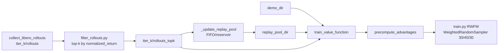

# RWFM A1-B7 方案详细实现说明

本文档描述当前仓库中 A1-B7 的实际落地实现（不包含 A3，已按决策放弃；B8 不在本文范围内）。

## 1. 目标与总体流程

A1-B7 的目标是把 RWFM 训练链路做成可迭代、可校验、可复现的离线 RL 管线，核心流程为：

1. 收集 rollout（policy 生成）。
2. 训练 value function（VF）。
3. 预计算每帧 advantage。
4. 用 RWFM 加权训练 policy。
5. 按需进入下一轮迭代（B5），并支持 replay pool（B6）与 PER/IS（B7）。

对应脚本主链路：

- `scripts/collect_libero_rollouts.py`
- `scripts/train_value_function.py`
- `scripts/precompute_advantages.py`
- `scripts/train.py`
- `scripts/iterate_rwfm.py`（B5/B6 编排）

---

## 2. A1：Manifest 一致性与严格对齐

### 2.1 设计动机

RWFM 最大风险是「数据顺序漂移」：如果 rollout 文件集合或顺序变化，而 `advantages.npz` 仍按旧顺序，会出现样本与 advantage 错配。A1 的实现目标是把错配变成显式报错。

### 2.2 关键实现

核心文件：`src/openpi/training/rollout_manifest.py`

- 构建 canonical manifest（路径顺序、每 episode 长度、累积偏移）。
- 计算 `manifest_sha` 作为集合与顺序的哈希指纹。
- 提供 `manifest_npz_fields` / `load_manifest_from_npz`，把 manifest 信息写入和读出 `npz`。

在以下阶段统一使用 manifest：

- `scripts/train_value_function.py`：构建 manifest，按 manifest 顺序抽特征并缓存。
- `scripts/precompute_advantages.py`：构建 manifest，按同顺序输出 advantage，并写入 manifest 字段。
- `src/openpi/training/data_loader.py`：
  - `RolloutNpzDataset` 暴露 `manifest`。
  - `AdvantageInjectorDataset` 强制 `len(dataset) == len(advantages)`。
  - 如双方 manifest 可用，则强制 `manifest_sha` 完全一致，否则抛错并要求重跑 precompute。

### 2.3 行为结果

- 任何 rollout 文件增删改顺序导致的漂移，都会在训练前被拦截。
- `advantages.npz` 不再允许“循环对齐（cycling）”等隐式容错，必须严格一一对应。

---

## 3. A2：RolloutNpzDataset 内存优化（LRU）

核心文件：`src/openpi/training/data_loader.py`

`RolloutNpzDataset` 实现了按 episode 粒度的懒加载 + LRU 缓存：

- 仅在访问某个 frame 时加载对应 episode。
- 缓存大小由 `cache_size` 控制，超过上限时淘汰最旧 episode。
- DataLoader 多进程场景下，`__getstate__` 会重置缓存，避免跨进程共享状态问题。

说明：

- rollout 为压缩 `npz`，`mmap_mode` 不能完全避免解压成本，因此通过 LRU 约束常驻内存。

---

## 4. A3：分层采样方案（已放弃）

按决策，成功/失败分层采样不实现。当前代码路径中没有 A3 逻辑入口。

---

## 5. A4：Advantage 归一化与裁剪（默认 rank）

### 5.1 配置项

核心文件：`src/openpi/training/config.py`

- `rwfm_adv_normalize: Literal["none", "zscore", "rank"] = "rank"`
- `rwfm_adv_clip: float = 3.0`

### 5.2 损失实现

核心文件：`src/openpi/models/pi0.py`

- `_normalize_advantages(...)` 支持 `none/zscore/rank`。
- 若 `rwfm_adv_clip > 0`，先做对称裁剪再进入指数权重。
- `compute_loss(...)` 中 RWFM 权重：
  - `raw_w = exp(adv_hat / rwfm_beta)`
  - `weights = raw_w / mean(raw_w)`
  - 可选噪声自适应（`rwfm_noise_adaptive`）：`1 + (1-time)*(weights-1)`
  - 最终乘到 `fm_loss`。

### 5.3 训练侧透传

核心文件：`scripts/train.py`

- `train_step` 从 config 读取 `rwfm_adv_normalize` 与 `rwfm_adv_clip`，传入 `model.compute_loss`。

---

## 6. B5：迭代编排与 warm-weights

核心文件：`scripts/iterate_rwfm.py`

### 6.1 每轮结构

在 `--base-dir` 下按 `iter_k` 组织：

- `iter_k/rollouts/`
- `iter_k/vf/`
- `iter_k/advantages.npz`
- `iter_k/rwfm_ckpt/...`

### 6.2 编排阶段

每轮按阶段执行（可用 `--stages` 局部重跑）：

1. `rollouts`
2. `vf`
3. `advantages`
4. `train`

### 6.3 warm-weights 默认策略

- `weight_mode="warm-weights"` 为默认。
- `iter_0` 从 SFT params 起步。
- `iter_k (k>0)` 从上轮 RWFM 最后 step 的 `params` 加载。
- 训练进程通过 `dataclasses.replace` 构造新 `TrainConfig` 并调用 `scripts/train.py`，只继承参数权重，不复用上轮优化器/EMA/step（即“热权重、冷优化状态”）。

### 6.4 多目录 rollout 并集

B5 已支持 `rollout_dir + rollout_dirs` 组合输入，且顺序固定：

- 主目录在前（`rollout_dir`）。
- 额外目录在后（`rollout_dirs`）。

此顺序直接决定 manifest 顺序，影响后续 all frames flatten 对齐。

---

## 7. B6：Replay Pool（FIFO / Reservoir）+ 删除后强制重算

核心文件：`scripts/iterate_rwfm.py`

### 7.1 配置项

- `replay_pool_dir`
- `replay_pool_size`（0 为不裁剪）
- `replay_pool_mode`：`fifo` 或 `reservoir`

### 7.2 同步与裁剪逻辑

每轮 rollouts 后执行 `_update_replay_pool(...)`：

- 将 `iter_k/rollouts` 下的 `episode_*.npz` 按相对路径拷贝到 pool。
- `fifo`：按文件 `mtime` 淘汰最旧样本。
- `reservoir`：固定种子随机保留上限数量，其余淘汰。

### 7.3 训练输入切换

启用 replay pool 后，VF/precompute/train 的主输入目录改为 pool（替代 `iter_k/rollouts`），使训练数据由“当前池状态”决定。

### 7.4 删除文件后的强制重算机制

依赖 A1 的 manifest 校验链：

- pool 文件变化 -> `manifest_sha` 变化。
- `train_value_function.py` 中缓存特征的 manifest 不匹配时重抽。
- `precompute_advantages.py` / `AdvantageInjectorDataset` 的 manifest 不匹配时拒绝旧优势并要求重算。

因此，手工删除 pool 文件不会静默污染训练，会触发显式重算路径。

---

## 8. B7：离线 PER 采样 + IS 校正

核心文件：`src/openpi/training/config.py`、`src/openpi/training/data_loader.py`、`scripts/train.py`、`src/openpi/models/pi0.py`

### 8.1 新增配置项

- `rwfm_per_enabled: bool = False`
- `rwfm_per_alpha: float = 1.0`
- `rwfm_per_beta: float = 1.0`
- `rwfm_per_eps: float = 1e-6`

### 8.2 优先级构造

`data_loader.py::_compute_per_priorities(...)`：

- 以 advantage 为基础，先按 RWFM 的尺度做裁剪（结合 `rwfm_beta`、`rwfm_adv_clip`）。
- 计算 `exp(adv / beta)` 得到正权重。
- 加 `eps` 防止零概率。
- 用 `alpha` 控制尖锐度。

### 8.3 采样器

`create_torch_data_loader(...)` 中：

- 当 `per_enabled=True` 且非 DDP 分布式时，使用 `torch.utils.data.WeightedRandomSampler(replacement=True)`。
- `num_samples` 设为数据集长度，保证每个 epoch 抽样数量稳定。

### 8.4 IS 权重

`_compute_per_importance_weights(...)`：

- `p_i = priority_i / sum(priority)`
- `is_i = 1 / (N * p_i)`
- 归一化为 `is_i / max(is)`，再指数 `per_beta`。

IS 权重通过 `AdvantageInjectorDataset` 注入到 batch 的 `importance_weights` 字段。

### 8.5 损失中的乘法关系

`scripts/train.py::train_step` 会取出 `(obs, actions, advantages, importance_weights)`，传入模型。

`src/openpi/models/pi0.py::compute_loss` 的有效权重为：

- 先 RWFM 权重（advantage 导出）。
- 再逐样本乘 `importance_weights`（IS 校正）。

即 B7 要求的“IS 与 RWFM 权重相乘”已在 loss 内完成。

---

## 9. 关键配置与运行建议

## 9.1 RWFM 基础配置（建议）

在 `TrainConfig` 中至少确认：

- `rwfm_enabled = True`
- `rwfm_advantages_path` 指向当前迭代输出的 `advantages.npz`
- `rwfm_adv_normalize = "rank"`（当前默认）
- `rwfm_adv_clip = 3.0`

## 9.2 打开 B7

- `rwfm_per_enabled = True`
- 可从默认开始：`alpha=1.0, beta=1.0, eps=1e-6`

## 9.3 迭代运行（B5/B6）

推荐从 `scripts/iterate_rwfm.py` 统一启动，避免手工串联阶段引入目录顺序或 checkpoint 选择错误。

## 9.4 最小可跑命令模板

下面给出四套“可直接复制”的最小模板。请将示例路径替换为你本机实际路径。

### 模板 A：单轮、无 replay pool、无 PER（最基础）

```bash
python scripts/iterate_rwfm.py \
  --base-dir data/libero/rwfm_iters_demo \
  --sft-config pi0_libero_fewshot \
  --sft-checkpoint-dir /path/to/checkpoints/pi0_libero_fewshot/physical-intelligence/libero/4999 \
  --train-config-name pi0_libero_rwfm \
  --num-iters 1 \
  --num-trials-per-task 10 \
  --vf-num-steps 2000 \
  --num-train-steps 5000 \
  --batch-size 32
```

### 模板 B：多轮 warm-weights（B5）

```bash
python scripts/iterate_rwfm.py \
  --base-dir data/libero/rwfm_iters_warm \
  --sft-config pi0_libero_fewshot \
  --sft-checkpoint-dir /path/to/checkpoints/pi0_libero_fewshot/physical-intelligence/libero/4999 \
  --train-config-name pi0_libero_rwfm \
  --weight-mode warm-weights \
  --num-iters 3 \
  --num-trials-per-task 20 \
  --vf-num-steps 5000 \
  --num-train-steps 30000
```

### 模板 C：多轮 + replay pool（B6，FIFO）

```bash
python scripts/iterate_rwfm.py \
  --base-dir data/libero/rwfm_iters_pool \
  --sft-config pi0_libero_fewshot \
  --sft-checkpoint-dir /path/to/checkpoints/pi0_libero_fewshot/physical-intelligence/libero/4999 \
  --train-config-name pi0_libero_rwfm \
  --num-iters 4 \
  --replay-pool-dir data/libero/replay_pool \
  --replay-pool-size 4000 \
  --replay-pool-mode fifo
```

若你希望“等概率保留历史样本”，将 `--replay-pool-mode fifo` 改为 `--replay-pool-mode reservoir`。

### 模板 D：多轮 + replay pool + PER（B6+B7）

`iterate_rwfm.py` 会把配置传给 `train.py`，PER 开关在 `TrainConfig` 生效。最稳妥方式是新增一个 config（例如 `pi0_libero_rwfm_per`）并在其中启用：

- `rwfm_per_enabled = True`
- `rwfm_per_alpha = 1.0`
- `rwfm_per_beta = 1.0`
- `rwfm_per_eps = 1e-6`

然后运行：

```bash
python scripts/iterate_rwfm.py \
  --base-dir data/libero/rwfm_iters_pool_per \
  --sft-config pi0_libero_fewshot \
  --sft-checkpoint-dir /path/to/checkpoints/pi0_libero_fewshot/physical-intelligence/libero/4999 \
  --train-config-name pi0_libero_rwfm_per \
  --num-iters 4 \
  --replay-pool-dir data/libero/replay_pool_per \
  --replay-pool-size 4000 \
  --replay-pool-mode fifo
```

### 常用调试命令

只看将执行什么，不真正运行：

```bash
python scripts/iterate_rwfm.py \
  --base-dir data/libero/rwfm_iters_dryrun \
  --sft-checkpoint-dir /path/to/4999 \
  --dry-run
```

仅重跑某些阶段（例如只重算 VF 与优势）：

```bash
python scripts/iterate_rwfm.py \
  --base-dir data/libero/rwfm_iters_pool \
  --sft-checkpoint-dir /path/to/4999 \
  --start-iter 2 \
  --num-iters 1 \
  --stages vf advantages
```

---

## 10. 常见问题排查

1. 训练时报 `manifest_sha mismatch`
   - 原因：rollout 文件集合/顺序与 `advantages.npz` 不一致。
   - 处理：重跑 `precompute_advantages.py`（必要时先重跑 `train_value_function.py`）。

2. 开启 PER 后效果不稳定
   - 先减小 `rwfm_per_alpha`（例如 0.6~0.8）平滑采样分布。
   - 或增大 `rwfm_adv_clip` 前先确认 advantage 尾部分布是否异常。

3. 使用 DDP 时 PER 没生效
   - 当前实现下，分布式 sampler 优先，PER 在 DDP 路径会降级并告警。

4. replay pool 手工删文件后是否要手工清缓存
   - 不需要。manifest 校验会自动触发特征/优势重算路径。

---

## 10.5 B9：入池 top-k + 三源配比采样

### 目标与动机

纯 B5/B6 在若干轮后会出现 **自训练漂移**：旧池被新数据稀释、低质量失败轨迹累积，导致回归式性能下降。B9 增加两层控制，同时保留已有的 RWFM/PER/replay-pool 通路。

1. **入池门控（top-k 过滤）**：每轮 rollout 结束后，按 episode 的 `normalized_returns.mean()` 排序，只保留 top-k%（成功 + 高 return 失败都会被选中），其余不入池、不参与训练。
2. **三来源配比采样**：训练阶段把 **demo 目录 / 历史池 / 本轮 top-k** 作为三段 concat 的 rollout 源交给 manifest，在 DataLoader 侧用 `WeightedRandomSampler` 让三段帧被采到的 **期望比例 = 30/40/30**（默认）。

### 组件清单

| 作用 | 文件 | 关键函数 / 字段 |
| ---- | ---- | ---- |
| 单轮 top-k 过滤脚本 | `scripts/filter_rollouts.py` | `--src-dir`, `--dst-dir`, `--keep-ratio`, `--min-success-floor` |
| 迭代编排接入 | `scripts/iterate_rwfm.py` | `topk_keep_ratio`, `topk_min_success_floor`, `demo_dir`, `source_ratios`, `_stage_topk_filter`, `_resolve_source_ratios` |
| 训练配置新字段 | `src/openpi/training/config.py` | `TrainConfig.rwfm_source_ratios`, `TrainConfig.rwfm_source_dirs` |
| 权重采样器实现 | `src/openpi/training/data_loader.py` | `_build_source_weights`, B9 分支构造 `WeightedRandomSampler` |

### 每轮目录布局

```
iter_{k}/
  rollouts/           # 原始 rollout（永远保留，便于复查）
  rollouts_topk/      # top-k 过滤后的副本（pool sync + VF/adv/train 实际消费）
  vf/
  advantages.npz
  rwfm_ckpt/...
```

当 `topk_keep_ratio >= 1.0` 时 `rollouts_topk/` 不产生，流程回退到 B6 行为。

### 数据流



三源 concat 顺序固定为 `[demo, pool, topk]`。`iterate_rwfm.py` 的 `_rollout_dirs` 按此顺序构造，disable 的源会被丢弃并自动重新归一化比例（`_resolve_source_ratios`）。

### 运行命令

```bash
python scripts/iterate_rwfm.py \
  --base-dir data/libero/rwfm_iters_topk \
  --sft-config pi0_libero_fewshot \
  --sft-checkpoint-dir /path/to/checkpoints/pi0_libero_fewshot/physical-intelligence/libero/4999 \
  --train-config-name pi0_libero_rwfm \
  --num-iters 4 \
  --replay-pool-dir data/libero/replay_pool_topk \
  --replay-pool-size 4000 \
  --replay-pool-mode fifo \
  --topk-keep-ratio 0.5 \
  --demo-dir /path/to/exported_demos \
  --source-ratios 0.3 0.4 0.3
```

参数约定：

- `--topk-keep-ratio 1.0` 关闭 B9 入池过滤（保持旧行为）。
- `--no-topk-min-success-floor` 禁用“所有 success=True 必留”，改为纯分数 top-k。
- `--demo-dir ""` 关闭 demo 源，比例自动降为 `[pool, topk]`。
- `--replay-pool-dir ""` 关闭历史池，比例自动降为 `[demo, topk]` 或仅 `[topk]`。
- 只剩一个源时 `rwfm_source_ratios` 自动清空，回退到均匀采样（shuffle）。

### 采样器语义

`_build_source_weights` 为每个源目录单独构造 `RolloutManifest` 拿到帧数 `n_i`，再给该源内每帧赋权 `ratios[i] / max(n_i, 1)`，因此：

- **期望比例** 严格等于 `ratios`（不受各源大小差异影响）。
- **批内波动** 遵循多项分布；以 `batch=32` + `(0.3, 0.4, 0.3)` 为例每类 std 约 2~3 帧，属可接受范围。
- `WeightedRandomSampler` 以 `replacement=True` 采样；同一帧可被多次采到，但在大数据集上概率很低。
- 与 `AdvantageInjectorDataset` 完全兼容：advantage 按 **全局 index** 索引，采样顺序不影响对齐。
- **DDP 兼容性**：若 `torch.distributed` 已初始化，`DistributedSampler` 优先，B9 采样器降级并告警；与 PER 同时开启时 B9 胜出，PER 被禁用并告警。

### 推荐默认

- `topk_keep_ratio = 0.5`
- `source_ratios = (0.3, 0.4, 0.3)`
- `replay_pool_size ≈ 3 × 单轮 topk 后 episode 数`（保持池占主导）
- `rwfm_beta = 1.5 ~ 2.0`（配合 top-k 保守一些避免采样 + advantage 双重尖锐化）

### 回滚与验证

1. **干跑目录**：`--dry-run` 下 `_stage_topk_filter` 也被跳过，可先核对三源目录和 inline 脚本注入参数。
2. **小规模冒烟**：`--num-trials-per-task 2 --num-train-steps 200` 跑一轮，确认 `rollouts_topk/` 生成、manifest SHA 一致、训练日志中出现 `B9 source-weighted sampling: ...`。
3. **回滚策略**：保留 `iter_{k-1}/rwfm_ckpt/`，若某轮验证下降，直接 `--start-iter k-1 --num-iters 1` 重跑该轮，或改小 `topk_keep_ratio`。
4. **encoder_features 缓存**：三源目录 / 池 / top-k 任一变化都会改变 `manifest_sha`，`train_value_function.py` 与 `precompute_advantages.py` 会强制重算，无需手工清缓存。

---

## 11. 变更索引（按职责）

- Manifest 与一致性：`src/openpi/training/rollout_manifest.py`
- 数据集与采样：`src/openpi/training/data_loader.py`
- 训练配置：`src/openpi/training/config.py`
- 模型损失：`src/openpi/models/pi0.py`
- 训练入口：`scripts/train.py`
- VF 训练：`scripts/train_value_function.py`
- Advantage 预计算：`scripts/precompute_advantages.py`
- 迭代编排（B5/B6/B9）：`scripts/iterate_rwfm.py`
- Top-k 过滤（B9）：`scripts/filter_rollouts.py`

本文档以当前仓库实现为准；若后续修改这些文件，请同步更新本说明。

